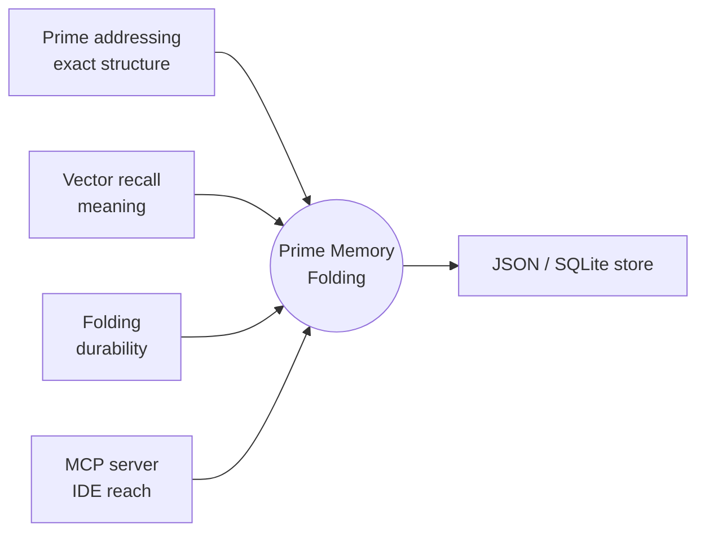
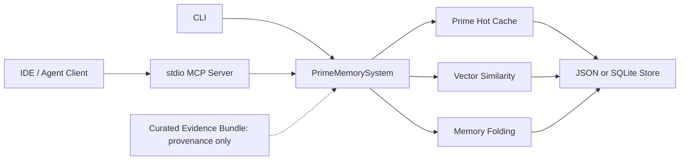
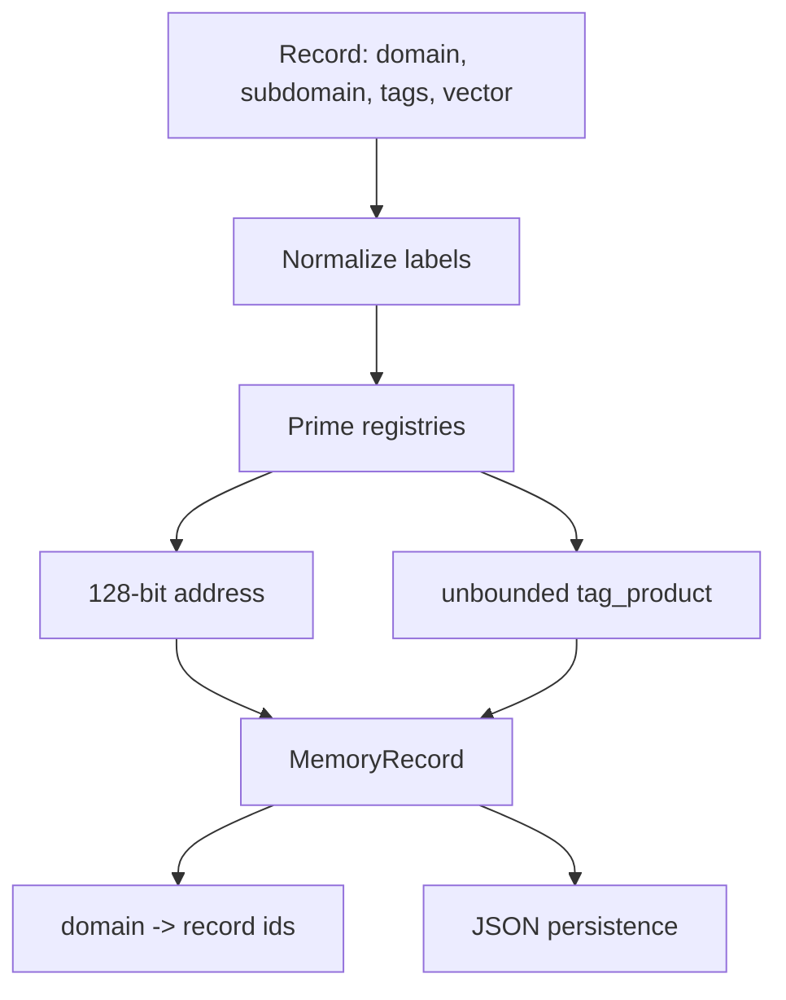
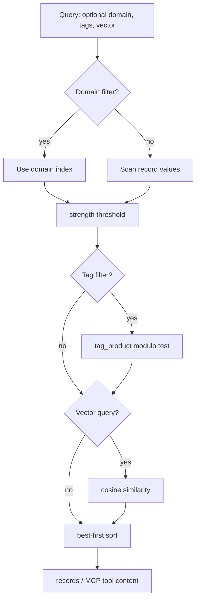
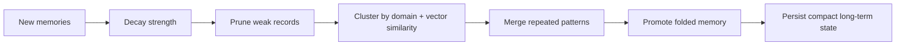
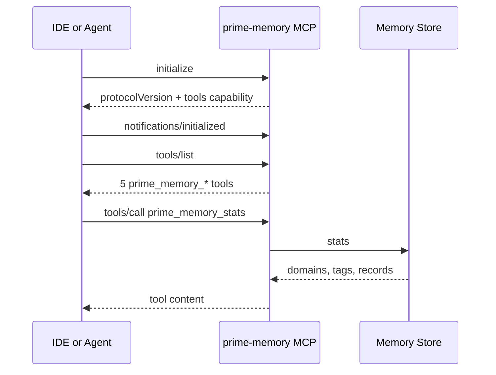

# Prime Memory Folding

[](https://github.com/coryhubbell/prime-memory-folding/actions/workflows/ci.yml)
[](LICENSE)
[](pyproject.toml)
[](CHANGELOG.md)
[](docs/MCP_IDE_SETUP.md)

Standalone prime-addressed memory encoding with vector-aware folding and MCP IDE integration.

**A small, honest, composable memory engine — extracted from the Aether-Hyper research system, with the math made public and the identity-bearing internals left behind.**

Prime Memory Folding is not the claim that prime numbers beat databases. It is a reproducible *composition*: deterministic prime-addressed structure, semantic vector recall, decay-driven folding, and an MCP server — each layer doing the job it is actually good at, with a public claim surface kept deliberately narrower than the ambition. If a claim isn't demonstrable from the code, tests, benchmarks, or evidence in this repo, it isn't here.



## What it is

- **Exact structure** — an O(1) domain index plus exact tag intersection by unbounded prime-product divisibility (deterministic, not fuzzy).
- **Meaning** — dependency-free cosine vector recall, additive to structure.
- **Durability** — folding that decays, clusters, and compresses memory so it isn't an append-only log; JSON by default, optional stdlib SQLite.
- **Reach** — a stdio MCP server (5 tools) with a CI-smoke-tested protocol handshake.
- **Provenance** — a slim `evidence/` bundle showing the Aether origin; not imported by the runtime.

## What it isn't

- Not a database replacement; not "orders of magnitude" anything.
- Not sublinear tag search — tag filtering is O(n) candidates × one modulo each; the O(1) part is the domain index.
- Not validated against live IDE clients yet — the protocol handshake is smoke-tested in CI; live-client validation is a tracked release gate.
- Not a consciousness runtime — the identity-bearing internals stayed home by design.

## Why it's credible

Benchmarks verify result-set equivalence *before* timing and show modest, dataset-dependent constant-factor wins over naive in-memory scans — stated as exactly that. The historical "60,000×" figure from the origin is retained only as caveated provenance. The repo was shaped by an adversarial build loop (a human director plus independent build/review lanes) that caught and corrected a broken headline encoding path and a benchmark that initially flattered the project.

## Read by intent

- **Use it** → [Quick Start](#quick-start)
- **Trust it** → [Benchmarks](#benchmarks) · [Technical Reproducibility Thesis](docs/TECHNICAL_REPRODUCIBILITY_THESIS.md)
- **Wire it into an IDE** → [MCP / IDE setup](docs/MCP_IDE_SETUP.md)
- **Understand the design** → [Architecture](docs/ARCHITECTURE.md) · [Whitepaper](docs/TECHNICAL_WHITEPAPER.md)
- **Where it came from** → [Provenance & Breakthrough Thesis](docs/PUBLIC_THESIS.md) · [Evidence](evidence/README.md)

## System Map



## Encoding Model

Each record has a compact 128-bit address plus an unbounded Python integer for exact tag filtering.

```text
domain_prime << 96 | subdomain_prime << 64 | concept_bucket << 32 | stable_instance_id
```

The address stays compact. The record also stores:

```text
tag_product = product(prime(tag) for tag in record.tags)
```

A query for all records tagged `technical` and `code` becomes:

```text
record.tag_product % product(prime("technical"), prime("code")) == 0
```



## Query Flow



## Folding Pipeline



## MCP Handshake

The stdio server is hardened around protocol fixtures and malformed-frame recovery. CI smoke-tests `initialize`, `notifications/initialized`, `tools/list`, and `tools/call`; live IDE clients are still a manual validation step.



The server exposes:

- `prime_memory_encode`
- `prime_memory_store`
- `prime_memory_query`
- `prime_memory_fold`
- `prime_memory_stats`

## Quick Start

```bash
git clone https://github.com/coryhubbell/prime-memory-folding.git
cd prime-memory-folding
python3 -m unittest discover -s tests
python3 -m prime_memory_folding encode architecture --tags '["technical","standalone"]'
python3 -m prime_memory_folding remember "Prime filters are for hot deterministic recall." --tags '["prime","technical"]' --vector '[1,0,0]' --importance 0.9
python3 -m prime_memory_folding query --tags '["technical"]'
python3 -m prime_memory_folding fold
```

Run the MCP server directly:

```bash
python3 -m prime_memory_folding.mcp_server
```

Or through the npm-style launcher:

```bash
node bin/prime-memory-folding-mcp.js
```

See [docs/MCP_IDE_SETUP.md](docs/MCP_IDE_SETUP.md) for Claude, Cursor, VS Code, and JetBrains configuration examples.

## Benchmarks

Reproducible filter benchmarks compare the prime-addressed store against naive full scans on a seeded dataset and verify identical result sets before timing:

```bash
python3 benchmarks/benchmark_filters.py
```

Typical local results in the current alpha are in this range:

| Path | What It Measures | Honest Read |
| --- | --- | --- |
| `domain_filter_unsorted` | domain index vs full scan | clear constant-factor win |
| `tag_predicate_only` | raw modulo predicate vs `set.issubset` | faster in the bundled benchmark |
| `tag_filter_unsorted` | full unsorted tag query | parity to modestly faster |
| `tag_query_sorted` | full sorted query path | parity to modestly faster |

Absolute timings are machine-dependent. These numbers are not comparable to the historical "60,000x vs SQL" figure in the evidence bundle; that is retained as provenance and caveated in [evidence/README.md](evidence/README.md).

## Repository Layout

```text
prime_memory_folding/       Python core, CLI, and MCP server
tests/                      Standard-library unit tests
benchmarks/                 Reproducible filter benchmarks
examples/                   Minimal usage example
docs/                       Technical docs and collaboration plans
ide/                        IDE configuration templates
evidence/                   Curated Prime prior-art docs and origin cache code
bin/                        Node launcher for MCP distribution
```

## Evidence And Provenance

Prime Memory Folding is standalone at runtime. The `evidence/` folder is not imported by the package; it exists so builders can inspect the origin of the idea:

- the original Prime cache implementation
- three Prime architecture analyses
- a visual prime-vs-traditional comparison
- a historical disclaimer that separates Aether-internal figures from this project's reproducible benchmarks

## Roadmap

- GitHub release tag and path-neutral IDE setup templates.
- Vector backend adapters, memory pack import/export, live IDE smoke validation, and optional Aether provenance adapters.

## Status

`v0.1.0-alpha` is dependency-light, MIT-licensed, and designed for local-first experimentation. It is ready for developers who want to inspect the math, run the tests, and wire a small deterministic memory engine into agentic IDE workflows.
